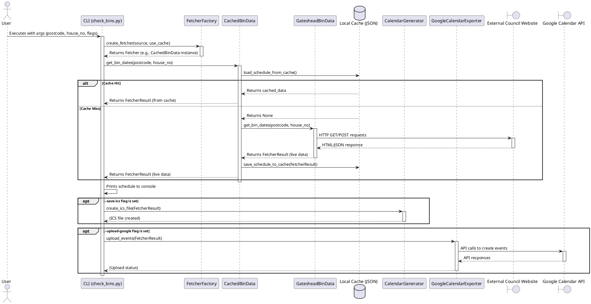

# Gateshead Bin Day Calendar

## Table of Contents

1.  [Overview](#overview)
2.  [Key Features](#key-features)
3.  [Architecture and Technology](#architecture-and-technology)
    * [High-Level Architecture](#high-level-architecture)
    * [Technology Choices](#technology-choices)
4.  [Technical Overview](#technical-overview)
5.  [Python File Summaries (src directory)](#python-file-summaries-src-directory)
6.  [Installation Guide](#installation-guide)
7.  [Usage](#usage)
    * [Command-Line Interface (CLI)](#command-line-interface-cli)
8.  [Environment Variables](#environment-variables)
9.  [Google Calendar Integration Setup](#google-calendar-integration-setup)
10. [Testing](#testing)
11. [Troubleshooting Tips](#troubleshooting-tips)

## Overview

This project is designed to fetch bin collection schedules for residents of Gateshead, UK. It processes this information to generate standard iCalendar (`.ics`) files, which can be imported into most calendar applications. Additionally, it offers the capability to automatically upload these schedules to a specified Google Calendar, helping users stay informed about their upcoming bin collections. The application is run as a command-line script locally.

## Key Features

* **Automated Bin Schedule Fetching:** Retrieves up-to-date bin collection information directly from the Gateshead Council source.
* **iCalendar (.ics) File Generation:** Creates universally compatible `.ics` files for easy import into personal calendars.
* **Google Calendar Integration:** Optionally uploads bin schedules directly to a designated Google Calendar.
* **Caching Mechanism:** Supports caching of fetched data to minimize redundant requests to the data source and speed up subsequent lookups.
* **Command-Line Operation:** Executed as a local command-line script.
* **Configurable:** Utilizes environment variables for easy configuration of address details, API credentials, and behavior.

## Architecture and Technology

### High-Level Architecture

The system is composed of several key components that work together when the CLI script is executed:

1.  **Command-Line Interface (CLI - `src/check_bins.py`):** This is the main entry point. It parses user arguments, manages the overall workflow, and calls other modules to perform specific tasks.

2.  **Data Fetching Layer (`src/data_fetchers/`):** Responsible for retrieving bin collection data.
    * **`WorkspaceerFactory`:** A factory that decides which specific data fetcher to use based on configuration (currently hardcoded for Gateshead but designed for potential extension).
    * **`GatesheadBinData`:** The core fetcher for Gateshead Council. It navigates the council's website by making HTTP requests, handling forms, and parsing the HTML response to extract schedule details.
    * **`CachedBinData`:** An optional wrapper that adds a caching layer. It stores successful fetch results in local JSON files and retrieves from this cache if available, reducing the need for repeated live fetches.
    * **`BaseFetcher`:** An abstract base class that defines the common interface (`get_bin_dates` method) that all concrete data fetchers must implement.

3.  **Data Modeling (`src/data_models.py`):** Provides structured representations of the data.
    * `BinCollection`: Represents a single bin collection event (e.g., date, type of bin).
    * `WorkspaceerResult`: Encapsulates the full result from a fetch operation, including the address found and a list of `BinCollection` instances.

4.  **Calendar Generation (`src/calendar_generator.py`):** Transforms the fetched data into a standard calendar format. It takes the `WorkspaceerResult` and creates an iCalendar (`.ics`) object, populating it with events, dates, descriptions, and reminders. It can also save this object to an `.ics` file.

5.  **Google Calendar Export (`src/google_calendar.py`):** Manages the uploading of bin schedules to Google Calendar. This includes authenticating with the Google Calendar API using service account credentials, formatting events, checking for and avoiding duplicate entries, and creating new events in the user's specified calendar.

### PlantUML Diagrams

Below are PlantUML diagrams representing the system's architecture. You can copy this code into a PlantUML editor (like the online server at plantuml.com or an IDE plugin) to generate the diagrams.

#### Component Diagram Code
```plantuml
@startuml
skinparam componentStyle uml2

package "User Interaction" {
  [CLI (check_bins.py)] as CLI
}

package "Core Logic" {
  [FetcherFactory]
  [CalendarGenerator]
  [GoogleCalendarExporter]
  [DataModels]
}

package "Data Fetching Layer" {
  interface BinDataFetcher
  [CachedBinData] implements BinDataFetcher
  [GatesheadBinData] implements BinDataFetcher
}

CLI --> FetcherFactory : Uses
CLI --> CalendarGenerator : Uses
CLI --> GoogleCalendarExporter : Uses

FetcherFactory --> CachedBinData : Creates >
FetcherFactory --> GatesheadBinData : Creates >
CachedBinData o-- BinDataFetcher : Wraps (fetcher)
CachedBinData ..> GatesheadBinData : Can wrap

GatesheadBinData --> DataModels : Uses >
CalendarGenerator --> DataModels : Uses >
GoogleCalendarExporter --> DataModels : Uses >

[External Council Website/API] as ExternalAPI
GatesheadBinData --> ExternalAPI : Fetches data from

[Google Calendar API] as GoogleAPI
GoogleCalendarExporter --> GoogleAPI : Uploads data to

@enduml
```

#### Simplified CLI Sequence Diagram Code


### Technology Choices

* **Programming Language:** Python 3.
* **Key Libraries ():**
    * `requests`: For making HTTP requests to fetch data from the council website.
    * `beautifulsoup4`: For parsing HTML content from the council website.
    * `icalendar`: For creating and manipulating iCalendar (`.ics`) files.
    * `google-api-python-client`, `google-auth`, `google-auth-httplib2`: For interacting with the Google Calendar API.
    * `pytz`: For timezone handling, particularly with Google Calendar events.
    * `python-dotenv`: For loading environment variables from a `.env` file, simplifying configuration management.
* **Testing:** `pytest` and `pytest-mock` are used for unit and integration testing.

## Technical Overview

The application's operational flow is as follows:

1.  **Initiation & Configuration:** The user executes `python -m src.check_bins` from the command line. The script parses arguments and loads environment variables (from `.env` or the system) for defaults like postcode, house number, and Google Calendar API credentials.

2.  **Fetcher Instantiation:** Based on command-line flags, the `Workspaceer_factory.py` module is used to create an instance of the data fetcher. For Gateshead, this is `GatesheadBinData`. If the `--use-cache` flag is present, this instance is wrapped by `CachedBinData`.

3.  **Data Retrieval Process:**
    * The `get_bin_dates(postcode, house_number)` method of the (potentially cached) fetcher is called.
    * **Cache Check (if enabled):** `CachedBinData` first checks if a recent, valid JSON cache file exists for the given address in the `cache/` directory. If so, the data is loaded from this file, deserialized into `WorkspaceerResult`, and the live fetch is skipped.
    * **Live Fetch (if no cache or cache disabled):** `GatesheadBinData` performs the following:
        * Makes an initial HTTP GET request to the Gateshead Council's bin checker page to obtain necessary form session identifiers (like pageSessionId, fsid, nonce) from hidden input fields in the HTML.
        * Makes an HTTP GET request to an address lookup endpoint, using the postcode to get a list of properties and their UPRNs (Unique Property Reference Numbers). It then matches the provided house number (or selects one randomly if no house number is given) to find the target UPRN and full address text.
        * Makes an HTTP POST request, submitting the UPRN and session data to process the form and retrieve the HTML page containing the bin collection schedule for that specific address.
        * Parses this schedule HTML using BeautifulSoup to find tables and rows detailing collection dates, months, and bin types. It normalizes bin types (e.g., "Recycling - Paper and cardboard only" to "Recycling - Paper and cardboard") and maps them to standard colors.
    * The extracted data is structured into `BinCollection` objects, which are then compiled into a `WorkspaceerResult` object, also containing the formatted address.
    * **Cache Write (if enabled and live fetch occurred):** If the live fetch was successful, `CachedBinData` saves the `WorkspaceerResult` to a JSON file in the `cache/` directory.

4.  **Output and Actions (driven by `check_bins.py`):**
    * The fetched schedule (from `WorkspaceerResult`) is displayed as JSON on the console.
    * If the `--save-ics` flag is used:
        * `generate_calendar_object` (from `calendar_generator.py`) converts the `WorkspaceerResult` into an `icalendar.Calendar` object, adding each `BinCollection` as a VEVENT with details like summary, description, start date (as an all-day event), location, and a reminder. The `create_ics_file` function then writes this calendar object to `bin_collections.ics`.
    * If the `--upload-google` flag is used:
        * `GoogleCalendarExporter` (from `google_calendar.py`) is utilized. The class initializes the Google Calendar API service using stored credentials. For each bin collection, it parses the date (handling year rollovers relative to the current date), creates an event structure, and then checks if an identical event already exists in the target Google Calendar (by querying events with the same summary on the same day). If no duplicate is found, the new event is inserted into the calendar.

5.  **Logging:** Throughout the process, informational messages and errors are logged to `error.log` (by default) and to the console for critical errors.

## Python File Summaries (src directory)

* **`check_bins.py`**:
    * **Purpose:** Serves as the main command-line interface (CLI) and orchestrator for the application.
    * **Functionality:**
        * Uses `argparse` to define and parse command-line arguments (postcode, house number, cache usage, ICS saving, Google Calendar upload, source).
        * Loads default configurations (like postcode and house number) from environment variables using `dotenv`.
        * Sets up logging to both a file (`error.log`) and the console.
        * Calls `create_fetcher` from `Workspaceer_factory.py` to get an appropriate data fetcher instance, respecting the cache flag.
        * Invokes the fetcher's `get_bin_dates` method to retrieve the schedule.
        * Prints the fetched schedule (if successful) as formatted JSON to the standard output.
        * If the `--save-ics` flag is provided and collections are found, it calls `create_ics_file` from `calendar_generator.py` to generate and save an iCalendar file.
        * If the `--upload-google` flag is provided and collections are found, it instantiates `GoogleCalendarExporter` from `google_calendar.py` and calls its `upload_events` method.
        * Handles exceptions gracefully, logging errors and providing user-friendly messages to `stderr`.

* **`calendar_generator.py`**:
    * **Purpose:** Responsible for generating iCalendar (`.ics`) data from the fetched bin schedules.
    * **Functionality:**
        * `generate_calendar_object(fetcher_result, current_date)`: This is the core function. It takes a `WorkspaceerResult` object (containing address and list of bin collections) and an optional `current_date` (for determining year rollovers). It creates an `icalendar.Calendar` object and populates it with:
            * Calendar properties like `PRODID` and `VERSION`.
            * For each `BinCollection` in `Workspaceer_result.collections`, it creates an `icalendar.Event`.
            * Event properties include a `summary` (e.g., "Household Waste bin collection"), a `description` (including bin type, color, and link), `location` (the address text), and `dtstart` (the collection date, treated as an all-day event).
            * It correctly determines the year for the collection date, handling cases where the collection month is in the next calendar year relative to `current_date`.
            * Adds an `icalendar.Alarm` component to each event for a reminder (e.g., 4.5 hours before midnight on the day of collection, effectively 7:30 PM the day before).
            * Sets event transparency to `TRANSPARENT` (marking it as free time).
        * `create_ics_file(fetcher_result, current_date)`: Calls `generate_calendar_object` to get the calendar data, then serializes it using `cal.to_ical()` and writes the bytes to a file named `bin_collections.ics` in the current working directory.

* **`data_models.py`**:
    * **Purpose:** Defines the Pydantic-like data structures (using `dataclasses`) for consistent data handling across the application.
    * **Functionality:**
        * `@dataclass class BinCollection`: Represents a single bin collection event. Its fields include `date` (e.g., "10 Thursday"), `month` (e.g., "April"), `bin_type` (e.g., "Household Waste"), `bin_colour` (e.g., "green"), and an optional `bin_link`.
        * `@dataclass class FetcherResult`: Represents the complete, successful result from a data fetching operation. It contains `address_text` (the formatted string of the address for which collections were fetched) and `collections` (a list of `BinCollection` objects). It also includes a helper method `collections_as_dicts()` to convert the list of `BinCollection` objects into a list of dictionaries, useful for JSON serialization (e.g., for caching).

* **`google_calendar.py`**:
    * **Purpose:** Encapsulates all logic for interacting with the Google Calendar API.
    * **Functionality:**
        * `class GoogleCalendarExporter`:
            * `__init__(calendar_id, timezone)`: Initializes the exporter. It requires a `calendar_id` (target Google Calendar) and defaults to 'Europe/London' timezone. Calendar ID is fetched from the `BINS_GOOGLE_CALENDAR_ID` environment variable if not provided directly. It calls `_build_service()` to set up the API client.
            * `_get_credentials()`: Manages authentication. It attempts to load service account credentials first from the `BINS_GOOGLE_CREDENTIALS_JSON` environment variable (a JSON string). If that's not available or fails, it falls back to `BINS_GOOGLE_CREDENTIALS` (a file path to the JSON key file). It uses `google.oauth2.service_account.Credentials` for this.
            * `_build_service()`: Uses the obtained credentials to build and return a Google Calendar API service object (`googleapiclient.discovery.build`).
            * `_parse_collection_date(collection, current_date)`: Converts a `BinCollection`'s date string and month into a `datetime.date` object, correctly determining the year and handling rollovers into the next calendar year based on the `current_date`.
            * `_create_event_data(collection, address, event_date)`: Formats a `BinCollection` and address details into the dictionary structure required by the Google Calendar API for creating an event (including summary, description, start/end dates for an all-day event, location, reminders, and transparency).
            * `_find_existing_event(summary, event_date)`: Queries the Google Calendar for events matching a given summary on a specific date to avoid creating duplicates. It searches within a time range for the given day.
            * `upload_events(fetcher_result, current_date_override)`: Orchestrates the upload process. It iterates through `BinCollection` objects in the `Workspaceer_result`. For each, it parses the date, creates event data, checks for existing duplicates using `_find_existing_event`, and if no duplicate is found, inserts the new event into the Google Calendar using `self.service.events().insert().execute()`. It logs successes and failures.

* **`data_fetchers/base_fetcher.py`**:
    * **Purpose:** Defines the abstract contract for all data fetching classes.
    * **Functionality:**
        * `class BinDataFetcher(abc.ABC)`: An abstract base class using Python's `abc` module.
        * `@abc.abstractmethod def get_bin_dates(self, postcode: str, house_number: str) -> Optional[FetcherResult]`: Declares the essential method that all concrete fetcher implementations must provide. This method is expected to take a postcode and house number (or name) and return a `WorkspaceerResult` object if successful, or `None` if fetching or parsing fails. This ensures a consistent interface for different data sources (though only Gateshead is implemented).

* **`data_fetchers/cached_data_fetcher.py`**:
    * **Purpose:** Provides a caching decorator or wrapper for any `BinDataFetcher` to reduce redundant API calls or web scraping.
    * **Functionality:**
        * `CACHE_DIR`: Defines the directory (`cache/` in the project root) where cache files are stored.
        * `_get_cache_filename(postcode, house_number)`: Generates a unique, safe filename for the cache based on postcode and house number (handles `None` house_number for random selection cases).
        * `load_schedule_from_cache(postcode, house_number)`: Attempts to load and deserialize JSON data from the corresponding cache file. Returns the data as a dictionary if successful and valid, otherwise `None`.
        * `save_schedule_to_cache(postcode, house_number, result_data)`: Serializes a `WorkspaceerResult` object (using its `collections_as_dicts()` method) into JSON and saves it to the appropriate cache file.
        * `class CachedBinData(BinDataFetcher)`:
            * `__init__(self, underlying_fetcher)`: Takes an instance of another `BinDataFetcher` (the "real" fetcher) to wrap.
            * `get_bin_dates(self, postcode, house_number)`: Implements the `BinDataFetcher` interface. When called:
                1.  It first attempts to `load_schedule_from_cache`.
                2.  If cache hit and valid, it reconstructs `BinCollection` objects from the cached dictionaries and returns a `WorkspaceerResult`.
                3.  If cache miss or invalid, it calls the `get_bin_dates` method of the `underlying_fetcher`.
                4.  If the underlying fetcher returns data successfully, this data is then passed to `save_schedule_to_cache` before being returned to the caller.
                5.  If the underlying fetcher fails, `None` is returned and nothing is cached.

* **`data_fetchers/fetcher_factory.py`**:
    * **Purpose:** Decouples the main application logic from concrete fetcher implementations, allowing for easier extension to other data sources in the future.
    * **Functionality:**
        * `create_fetcher(source: str, use_cache: bool) -> BinDataFetcher`: A factory function.
            * Takes a `source` string (e.g., "gateshead") and a boolean `use_cache` flag.
            * Based on the `source` string (case-insensitive), it instantiates the appropriate concrete `BinDataFetcher` (currently, only `GatesheadBinData` is supported).
            * If `use_cache` is `True`, it wraps the instantiated concrete fetcher with `CachedBinData`.
            * Returns the (possibly cached) fetcher instance.
            * Raises a `ValueError` if an unknown `source` is requested.

* **`data_fetchers/gateshead_bin_data.py`**:
    * **Purpose:** Implements the `BinDataFetcher` for retrieving bin collection schedules specifically from the Gateshead Council website.
    * **Functionality:** This is the most complex fetcher, involving direct web scraping.
        * `_get_form_session_data(session)`: Makes an initial request to the bin checker page to extract hidden form field values (session IDs, nonces) needed for subsequent requests.
        * `_get_address_udprn(postcode, house_number_target, session_data)`: Queries a council API endpoint with the postcode to get a list of addresses and their UPRNs. It then tries to match the `house_number_target` or picks a random one if `house_number_target` is not provided or not matched. Returns the UPRN and the full address string.
        * `_get_bin_schedule_html(udprn, session_data, address_text, postcode, house_number_target)`: Submits the UPRN and session data via a POST request to another council API endpoint to retrieve the HTML page that contains the actual bin collection schedule for the selected address.
        * `_parse_bin_schedule(schedule_html)`: Parses the HTML content from `_get_bin_schedule_html` using `BeautifulSoup`. It looks for a specific table (`class_='bincollections__table'`), iterates through its rows, and extracts the day, day of the week, month, and bin type (from link text). It normalizes bin type descriptions (e.g., removing " only" suffixes, mapping short names like "Household" to "Household Waste") and uses a predefined dictionary (`BIN_COLOURS`) to assign a color. It constructs `BinCollection` objects from this data.
        * `_fetch_bin_dates_from_website(postcode, house_number)`: Orchestrates the above private methods: gets session data, then UPRN, then schedule HTML, then parses it, and finally returns a `WorkspaceerResult`.
        * `get_bin_dates(postcode, house_number)`: The public method implementing the `BinDataFetcher` interface, which simply calls `_fetch_bin_dates_from_website`.

## Installation Guide

1.  **Prerequisites:**
    * Python 3 (the `run.sh` script uses `python3`).
    * `git` for cloning the repository.

2.  **Clone the repository:**
```bash
git clone [https://github.com/abnabnabn/gateshead-bin-day.git](https://github.com/abnabnabn/gateshead-bin-day.git)
cd gateshead-bin-day
```

3.  **Create and activate a virtual environment (highly recommended):**
```bash
python3 -m venv venv
source venv/bin/activate  # On Windows use `venv\Scripts\activate`
```

4.  **Install dependencies:**
```bash
pip install -r requirements.txt
```
    This will install all necessary libraries listed in `requirements.txt`, such as `requests`, `beautifulsoup4`, `icalendar`, `google-api-python-client`, and `python-dotenv`.

5.  **Set up Environment Variables:**
    Create a file named `.env` in the root directory of the project. Populate it with necessary configurations as detailed in the [Environment Variables](#environment-variables) section.

## Usage

### Command-Line Interface (CLI)

The primary way to run the application locally is via the `src/check_bins.py` script.

**Syntax:**
```bash
python -m src.check_bins [OPTIONS]
```

**Command-Line Options:**

* `-p YOUR_POSTCODE`, `--postcode YOUR_POSTCODE`:
    * Specifies the postcode for which to fetch bin collection dates.
    * If not provided, defaults to the `MY_POSTCODE` environment variable.
* `-n YOUR_HOUSE_NUMBER`, `--house-number YOUR_HOUSE_NUMBER`:
    * Specifies the house number or name for the address.
    * If not provided, defaults to the `MY_HOUSE_NUMBER` environment variable. If this is also not set, the script may attempt to use a random address for the postcode (behavior of the underlying fetcher).
* `-c`, `--use-cache`:
    * Enables the caching mechanism. If a valid cache file exists for the address, data will be read from it. Otherwise, data is fetched live and then cached.
    * By default, caching is **OFF**.
* `-g`, `--upload-google`:
    * Triggers the upload of the fetched bin schedule to the Google Calendar configured via environment variables.
* `-i`, `--save-ics`:
    * Saves the fetched bin schedule as an `.ics` file named `bin_collections.ics` in the project's root directory.
* `--source gateshead`:
    * Specifies the data source. Currently, only "gateshead" is a valid choice.

**Examples:**

1.  Fetch schedule using environment variables for postcode/house number, save to ICS, and upload to Google Calendar:
```bash
# Ensure MY_POSTCODE and MY_HOUSE_NUMBER are set in .env
python -m src.check_bins --save-ics --upload-google
```

2.  Fetch schedule for a specific address, use caching, and save to ICS:
```bash
python -m src.check_bins -p "NE95TJ" -n "10" --use-cache --save-ics
```

3.  Fetch schedule for a specific postcode (house number from env or random) and only print to console:
```bash
python -m src.check_bins -p "NE10AA"
```

**Using `run.sh`:**
The repository includes a `run.sh` script.
```bash
bash run.sh
```
By default, this script executes: `python3 -m src.check_bins --upload-google`. It relies on environment variables (`MY_POSTCODE`, `MY_HOUSE_NUMBER`, and Google Calendar settings) being configured in your `.env` file or system environment.

## Environment Variables

This project uses environment variables for configuration, loaded from a `.env` file in the project root (thanks to `python-dotenv`) or from the system environment.

* **`MY_POSTCODE`**:
    * Used by: `src/check_bins.py`
    * Purpose: Default postcode if not provided via command-line.
    * Example: `MY_POSTCODE="NE95TJ"`

* **`MY_HOUSE_NUMBER`**:
    * Used by: `src/check_bins.py`
    * Purpose: Default house number/name if not provided via command-line.
    * Example: `MY_HOUSE_NUMBER="10"`

* **`BINS_GOOGLE_CALENDAR_ID`**:
    * Used by: `src/google_calendar.py`
    * Purpose: The ID of the Google Calendar to which events will be uploaded. Found in Google Calendar settings (usually ends with `@group.calendar.google.com`).
    * Example: `BINS_GOOGLE_CALENDAR_ID="your_calendar_id@group.calendar.google.com"`

* **`BINS_GOOGLE_CREDENTIALS_JSON`**:
    * Used by: `src/google_calendar.py`
    * Purpose: A JSON string containing the Google Service Account credentials. This is one method of providing credentials.
    * Example: `BINS_GOOGLE_CREDENTIALS_JSON='{"type": "service_account", "project_id": "...", ...}'`

* **`BINS_GOOGLE_CREDENTIALS`**:
    * Used by: `src/google_calendar.py`
    * Purpose: The file path to a Google Service Account key JSON file. This is an alternative method to `BINS_GOOGLE_CREDENTIALS_JSON`. The JSON string method takes precedence if both are set.
    * Example: `BINS_GOOGLE_CREDENTIALS="/path/to/your/service-account-key.json"`

## Google Calendar Integration Setup

To use the Google Calendar integration, follow these comprehensive setup steps:

1.  **Create a Google Cloud Project & Enable Calendar API:**
    * Go to the [Google Cloud Console](https://console.cloud.google.com/).
    * If you don't have a project, click "Select a project" (or the current project name) > "New Project".
    * Enter a project name (e.g., "Bin Schedule Calendar Integration") and complete the creation process.
    * Once the project is selected, navigate to "APIs & Services" > "Library" (or click "+ ENABLE APIS AND SERVICES").
    * Search for "Google Calendar API" and click on it.
    * Enable the API for your project.

2.  **Set up a Service Account:**
    * In the Google Cloud Console, navigate to "APIs & Services" > "Credentials".
    * Click "+ CREATE CREDENTIALS" and select "Service account".
    * Enter a "Service account name" (e.g., "bin-scheduler-service-account"). The "Service account ID" will auto-populate. You can add an optional description.
    * Click "CREATE AND CONTINUE".
    * **Grant permissions (Role):** Click "Select a role". For the service account to manage calendar events, it needs permissions to read and write events. The "Google Calendar API User" role might be suitable, or a custom role with `calendar.events` permissions. For simplicity, "Editor" or roles that grant `serviceusage.services.use` along with calendar-specific permissions might be needed if the API isn't directly usable by default. **Crucially, ensure the service account has permission to write to the specific calendar you intend to use.**
    * Click "CONTINUE".
    * (Optional) Grant users access to this service account.
    * Click "DONE".

3.  **Create a Service Account Key:**
    * On the "Credentials" page, find the service account you just created.
    * Click on the service account's email address.
    * Go to the "KEYS" tab.
    * Click "ADD KEY" > "Create new key".
    * Select "JSON" as the key type and click "CREATE".
    * A JSON file containing the service account key will be downloaded. **Store this file securely.** This file will be used for `BINS_GOOGLE_CREDENTIALS` or its content for `BINS_GOOGLE_CREDENTIALS_JSON`.

4.  **Create or Select a Google Calendar and Share it with the Service Account:**
    * Go to [Google Calendar](https://calendar.google.com/).
    * You can either use an existing calendar or create a new one specifically for bin schedules:
        * To create a new one: In the left sidebar under "Other calendars", click the `+` icon and select "Create new calendar".
        * Enter a "Name" (e.g., "Bin Collection Schedule") and an optional "Description".
        * Click "Create calendar".
    * Once the calendar is created or if using an existing one, find it in your list of calendars on the left. Hover over it, click the three dots (Options), and select "Settings and sharing".
    * Under "Share with specific people or groups", click "+ Add people or groups".
    * Enter the email address of the service account you created in Step 2 (e.g., `bin-scheduler-service-account@your-project-id.iam.gserviceaccount.com`).
    * Set the "Permissions" for the service account to **"Make changes to events"**. This is essential for the script to add bin collection events.
    * Click "Send".

5.  **Configure Environment Variables:**
    Set the following environment variables in your `.env` file (or system environment):
```env
BINS_GOOGLE_CALENDAR_ID="your_calendar_id_from_calendar_settings@group.calendar.google.com"
```
    And choose **one** of the following for credentials:
```env
# Option 1: Path to the downloaded service account key JSON file
BINS_GOOGLE_CREDENTIALS="/path/to/your/downloaded-service-account-key.json"

# Option 2: The full JSON content of the service account key file as a string
BINS_GOOGLE_CREDENTIALS_JSON='{"type": "service_account", "project_id": "your-project-id", ...}'
```
    The Calendar ID can be found in the Google Calendar settings under "Integrate calendar" > "Calendar ID".

6.  **Test the Integration:**
    Run the script with the `--upload-google` flag:
```bash
python -m src.check_bins --upload-google
```
    * Verify that events appear in the Google Calendar you configured.
    * Check the console output and `error.log` for any API errors or messages.
    * The test file `test/test_google_calendar.py` can also be run to verify parts of the Google Calendar interaction logic (may require test-specific configurations or mocks).

## Testing

This project uses `pytest` for testing. Test files are located in the `test/` directory, organized mirroring the `src` structure.

1.  **Install development dependencies (if not already done):**
```bash
pip install -r requirements-dev.txt
```
    This installs `pytest` and `pytest-mock`.

2.  **Run tests:**
    From the root directory of the project, execute:
```bash
pytest
```
    Pytest will automatically discover and run tests from the `test` directory. The `pytest.ini` file configures `pythonpath` to ensure that modules in `src` and the project root can be correctly imported during tests.

## Troubleshooting Tips

* **"Postcode required" error:**
    * Ensure you've provided the `--postcode` argument or set the `MY_POSTCODE` environment variable in your `.env` file.

* **"Failed to fetch schedule" / "Could not find bin schedule for the specified address":**
    * Double-check that the postcode and house number/name are correct and correspond to an address within Gateshead Council's jurisdiction. The format expected by the council website is important.
    * The council's website structure or internal API endpoints might have changed. Check the `error.log` for more detailed error messages from the fetcher (e.g., HTML parsing errors, unexpected HTTP status codes).
    * Temporary network issues or problems with the council's website itself. Try accessing the [Gateshead Council bin checker](https://www.gateshead.gov.uk/article/3150/Bin-collection-day-checker) manually.

* **Google Calendar upload failures:**
    * **"Missing Google Calendar ID"**: Ensure `BINS_GOOGLE_CALENDAR_ID` is correctly set in your environment.
    * **Authentication Errors (e.g., 401 Unauthorized, 403 Forbidden)**:
        * Verify that your service account credentials (`BINS_GOOGLE_CREDENTIALS` file path or `BINS_GOOGLE_CREDENTIALS_JSON` string) are correct and the JSON is valid.
        * Ensure the Google Calendar API is enabled in your Google Cloud Project for the project associated with the service account.
        * Confirm that the service account's email address has been explicitly added to the specific Google Calendar with "Make changes to events" permission.
    * **"Failed to build Google Calendar service"**: Could be due to missing or malformed credentials, or issues with the Google API client libraries. Check `error.log`.
    * **Events not appearing**: Besides permissions, ensure the `BINS_GOOGLE_CALENDAR_ID` is for the exact calendar you are checking. Timezone issues can sometimes cause events to appear at unexpected times if not handled correctly (though this project sets 'Europe/London').
    * Check `error.log` (located in the project root by default) for detailed error messages from the `src/google_calendar.py` module.

* **Dependency Issues / `ModuleNotFoundError`:**
    * Make sure you have activated your virtual environment (`source venv/bin/activate` or `venv\Scripts\activate`).
    * Ensure all dependencies were installed correctly using `pip install -r requirements.txt`. Re-running this command can sometimes fix issues.

* **Incorrect Dates or Year Rollover Issues:**
    * The script attempts to handle year rollovers for dates. If dates seem off, especially around the new year, the logic in `src/calendar_generator.py` (for ICS) and `src/google_calendar.py` (for Google Calendar event dates) might need review.
    * Ensure your system's date and time are correctly set, as `datetime.now()` is used as a reference.

* **Cache Issues:**
    * If you suspect stale data, try running without the `--use-cache` flag to force a live fetch.
    * You can manually delete specific JSON files from the `cache/` directory (filenames are based on postcode and house number) or clear the entire directory.

* **HTML Parsing Errors (logged in `error.log` from `gateshead_bin_data.py`):**
    * This usually indicates that the Gateshead Council website's HTML structure (e.g., table classes, input field names, form submission URLs) has changed. This is a common issue with web scraping.
    * The selectors and parsing logic within `src/data_fetchers/gateshead_bin_data.py` (specifically in `_get_form_session_data`, `_get_address_udprn`, and `_parse_bin_schedule`) would need to be updated to match the new website structure. This might involve inspecting the council's website manually using browser developer tools.
